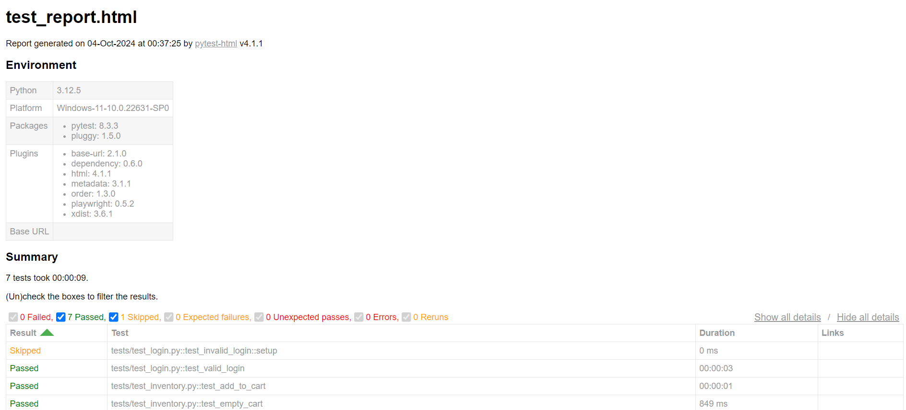
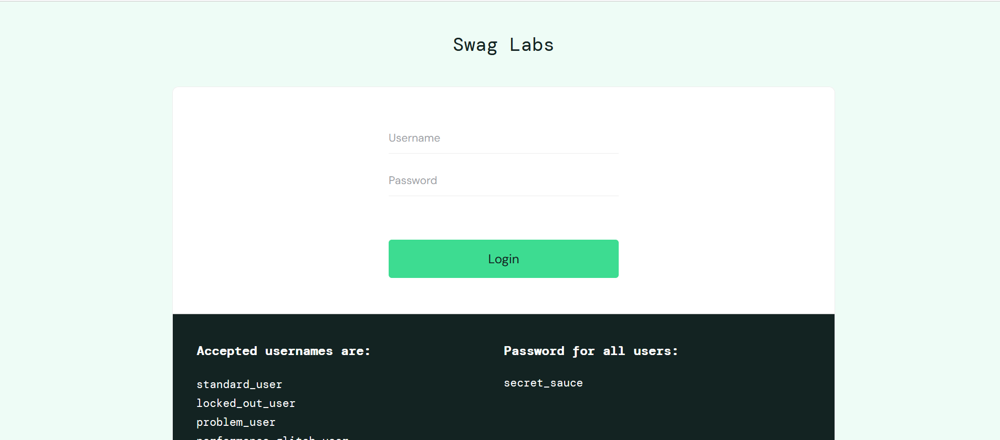
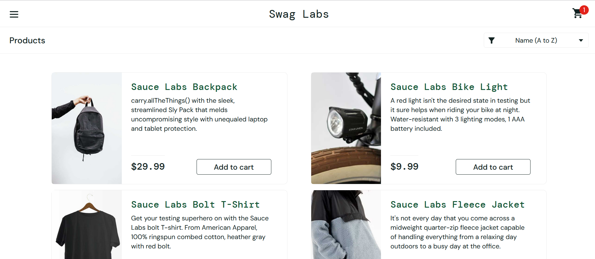

# Automating Saucedemo Webapp Testcases using Playwright and Pytest

**Objective -** 
 Automating testcases for Sauce demo 
webapplication using playwright and pytest

**Features -**
 - Page Object Model 
 - Data driven Testing
 - HTML Reporting
 - Logging
 - Parallel Execution of testcases
 - screenshots for test execution and failures
 - Multi browser testing
 - CI/CD Integration using Jenkins
 - Session Storing and Loading functionality
 - Tracing 

**Test Report Preview-**

**Web Application Preview-**

