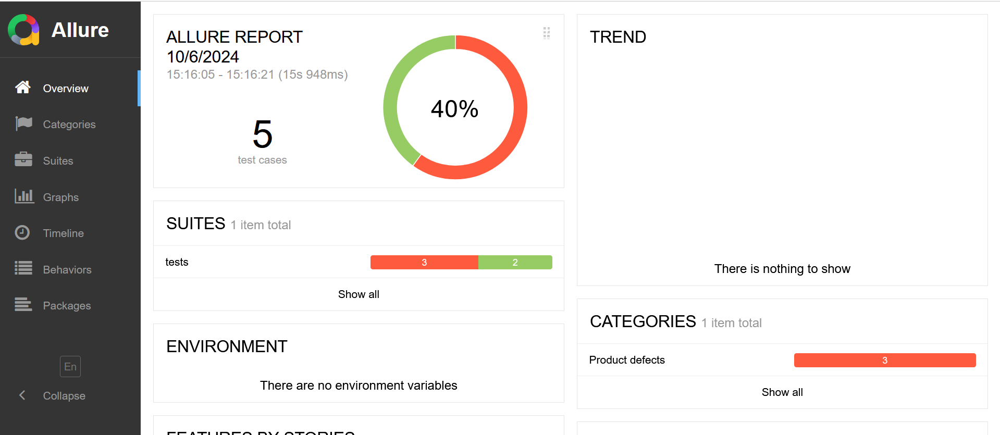
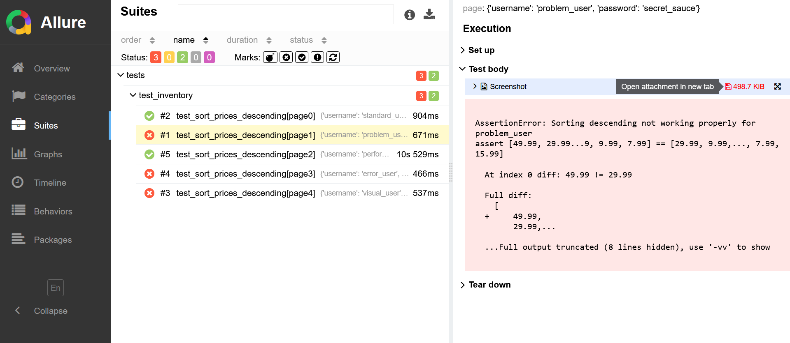
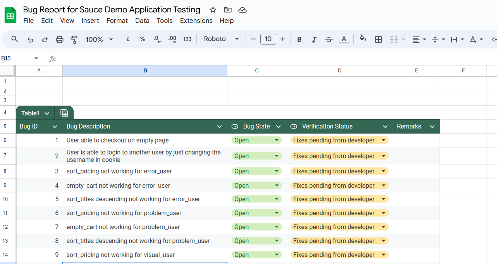

# Automating Saucedemo Webapp Testcases using Playwright and Pytest

**Objective -** 
 Automating testcases for Sauce demo 
webapplication using playwright and pytest

**Features -**
 - Page Object Model 
 - Data driven Testing
 - HTML Reporting
 - Logging
 - Parallel Execution of testcases
 - screenshots for test execution and failures
 - Multi browser testing
 - CI/CD Integration using Jenkins
 - Session Storing and Loading functionality
 - Tracing 

**Command to generate Allure test report in project directory-**

```
allure generate allure-results --clean -o allure-report
```

**Allure Test Report Preview -**

screenshots are also attached to failed testcase-



**HTML Test Report Preview-**


**Web Application Preview-**


**Bug Report -**

Link - https://docs.google.com/spreadsheets/d/1-3DCJGuB01RxRvMc_h8IJ_yKvAfeLIgDF1L-G9LUGRs/edit?usp=sharing

